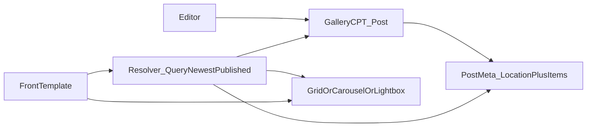

# How To: Location-Keyed Galleries (Custom Post Type + Post Meta)

Editors manage reusable image galleries in **wp-admin**. Each gallery post is tagged with a **location** (slot). On the frontend, templates ask for images by location; the backend returns **one canonical gallery per slot**—the **most recently published** post assigned to that slot. This pattern does **not** require Advanced Custom Fields (ACF): it uses a **private custom post type**, **classic metaboxes**, and **`post_meta`** for storage.

---

## What It Looks Like

- **Admin:** A **Galleries** (or similarly named) menu lists gallery posts. Each post has only a **title** (for internal labeling) plus metabox UI.
- **Location metabox** (typically sidebar): a dropdown of fixed slots—for example “Home: Before & After,” “Gallery page: The Clinic”—with **None** to leave a draft unassigned.
- **Images metabox** (main column): primary button opens the **WordPress Media Library** modal; editors pick one or many images. Thumbnails appear in a sortable list; **drag** to reorder; **×** to remove.
- **Frontend:** Sections that need a gallery call a resolver like `get_gallery_items_for_location( 'home_before_after' )` and receive an ordered array of **`url`, `thumb_url`, `alt`, `width`, `height`**. The **same data** can power a CSS grid, a carousel (e.g. Swiper), or thumbnails that open a lightbox.

---

## Dependencies

| Layer | Requirement |
|--------|----------------|
| **WordPress** | Custom post type API, metabox APIs, `save_post_{post_type}`, Capabilities (`edit_posts` / `edit_post`) |
| **Admin scripts** | `wp_enqueue_media()` so `wp.media` is available; **jQuery** for the modal + Sortable UX (enqueue only on the gallery edit screen) |
| **Frontend** | None required for plain `` grids; optionally **Swiper**, **lightGallery**, etc., depending on presentation |

Carousel and lightbox libraries are **presentation only**—they consume the normalized row data, not raw meta.

---

## Architecture (conceptual)



---

## Admin workflow

1. In **Posts → Galleries** (menu label varies), choose **Add New** or edit an existing gallery.
2. Set an **internal title** (helps identify the gallery in lists; not shown on the public site unless you choose to).
3. In the **Location** metabox, pick **exactly one** slot—or **None** if the post should not appear on the site yet.
4. In the **Images** metabox, click **Add Images** → Media Library opens → select images (**multiple** allowed) → confirm. Repeat to append more images.
5. Drag thumbnails into the desired **order**.
6. **Publish** or **Update**.

**Important behavior**

- Only **published** galleries participate in frontend resolution (typical setup).
- **One gallery wins per location:** if two published posts share the same location slug, the one with the **newer post date** wins (`orderby` date, descending, `posts_per_page` 1).
- The CPT should be **`public` => false** with **`show_ui` => true** so editors get a UI but **no public single URLs** unless you deliberately enable them.

---

## Data model (conceptual meta keys)

Use **leading underscores** if you want keys hidden from the default Custom Fields UI.

| Purpose | Example meta key | Stored value |
|--------|-------------------|---------------|
| Which slot | `_gallery_location` | String slug, e.g. `home_before_after` |
| Image list | `_gallery_images` | PHP **array** of items (WordPress stores serialized arrays when you pass an array to `update_post_meta`) |

The edit screen submits images as **JSON** in a hidden input (easiest for JS); on `save_post`, **`json_decode`** the POST value, sanitize each entry, then save with `update_post_meta( $post_id, '_gallery_images', $clean_array )`.

### Stored item shapes (after save)

Both shapes include a discriminator **`kind`**:

**Attachment (Media Library)**

```json
{
  "kind": "attachment",
  "id": 12345
}
```

**Raw URL** (bundled assets, CDN, imports that are not attachments, legacy content)

```json
{
  "kind": "url",
  "url": "https://example.com/path/to/image.jpg",
  "alt": "Accessible description"
}
```

Invalid or unrecognized entries should be dropped on save.

### Normalized row (what templates consume)

A small mapper expands each saved item into a **uniform associative array**:

| Field | Attachment source | URL source |
|--------|-------------------|------------|
| `url` | Attachment image **`large`** source URL | `url` from meta |
| `thumb_url` | Attachment **`medium_large`** (or same as `url` if size missing) | Same as `url` |
| `alt` | `_wp_attachment_image_alt` | `alt` from meta |
| `width`, `height` | From resolved `large` dimensions | Often `0, 0` if unknown |

Suggested WordPress helpers for attachments: `wp_get_attachment_image_src( $id, 'large' )` and `wp_get_attachment_image_src( $id, 'medium_large' )`. Choose image size names your theme registers or uses consistently.

Templates typically display **`thumb_url`**, falling back to **`url`** when the thumb is empty:

```pseudo
display_src = thumb_url !== '' ? thumb_url : url
```

---

## Resolver (backend pseudocode)

```php
function get_gallery_items_for_location( string $location_slug ): array {
    if ( ! is_valid_location( $location_slug ) ) {
        return array();
    }

    $posts = new WP_Query( array(
        'post_type'      => 'your_gallery_cpt', // e.g. gallery_cpt slug
        'post_status'    => 'publish',
        'posts_per_page' => 1,
        'orderby'        => 'date',
        'order'          => 'DESC',
        'fields'         => 'ids',
        'no_found_rows'  => true,
        'meta_query'     => array(
            array(
                'key'   => '_gallery_location',
                'value' => $location_slug,
            ),
        ),
    ) );

    if ( empty( $posts->posts ) ) {
        return array();
    }

    $post_id = (int) $posts->posts[0];
    $items   = get_post_meta( $post_id, '_gallery_images', true );

    if ( ! is_array( $items ) ) {
        return array();
    }

    $rows = array();
    foreach ( $items as $item ) {
        $row = map_item_to_row( $item ); // attachment vs url logic
        if ( null !== $row ) {
            $rows[] = $row;
        }
    }

    return $rows;
}
```

Memoize **per HTTP request** by location slug if the same gallery is queried from header, content, and footer.

---

## Security and save guards

When handling `save_post_your_cpt`:

- **Return early** on `DOING_AUTOSAVE`.
- Require a **`wp_nonce_field`** verified with `wp_verify_nonce`.
- Check **`current_user_can( 'edit_post', $post_id )`**.
- **Location:** sanitize as a slug/string; persist only if the value exists in your **central allowlist** of locations; otherwise **ignore** or delete meta. Clearing the dropdown may **`delete_post_meta`** for `_gallery_location`.
- **Images:** decode JSON safely; iterate and **whitelist** fields per `kind`; for attachments, cast `id` to int and reject ≤ 0; for URLs use `esc_url_raw` and `sanitize_text_field` for alt text.

---

## Frontend patterns

### Responsive grid

```php
<?php
$items = get_gallery_items_for_location( 'page_before_after' );
if ( empty( $items ) ) {
    return;
}
?>
<section class="gallery-section">
  <div class="gallery-grid">
    <?php foreach ( $items as $row ) : ?>
      <?php
      $src    = '' !== $row['thumb_url'] ? $row['thumb_url'] : $row['url'];
      $w      = $row['width']  > 0 ? $row['width']  : 400;
      $h      = $row['height'] > 0 ? $row['height'] : 300;
      ?>
      <div class="gallery-grid__item">
        "
          alt="<?php echo esc_attr( $row['alt'] ); ?>"
          width="<?php echo esc_attr( (string) $w ); ?>"
          height="<?php echo esc_attr( (string) $h ); ?>"
          loading="lazy"
          decoding="async"
        />
      </div>
    <?php endforeach; ?>
  </div>
</section>
```

Default **width/height** attributes avoid layout shift when attachments provide dimensions; URL-only items often need sane fallbacks.

### Carousel (same data)

Wrap each slide in your carousel markup; use `thumb_url` or `url` per design (full-bleed slides often use `url`).

```pseudo
foreach items as row
  swiper-slide [
    img src= row.thumb_url or row.url 
        alt= row.alt
        loading lazy
  ]
```

### Lightbox

Use **`url`** (larger/source) as the **`href`** on an anchor wrapping a thumbnail (`thumb_url` in the ``), or initialize the library from data attributes populated from **`url`**.

---

## Admin UI implementation notes (high level)

- Register **two metaboxes** on `add_meta_boxes_{post_type}`.
- **`wp_enqueue_media()`** plus a small script that instantiates **`wp.media({ library: { type: 'image' }, multiple: 'add' })`** and appends selected attachment IDs as `kind: attachment` items.
- Use **jQuery UI Sortable** (or equivalent) on the thumbnail list so order changes **`before`** form submit.
- On each change, **`JSON.stringify`** the item array into a **hidden `input`** so PHP receives one string field.
- Localize strings (modal title, button label, remove **aria-label**) with `wp_localize_script`.

Optional: show a badge on **URL** items in the grid so editors distinguish uploads from pasted URLs—if your seed data or tooling uses both kinds.

---

## Location registry / extending slots

Centralize allowed slugs in one place—for example:

```php
// Pseudocode registry
function gallery_location_labels(): array {
    return array(
        'home_before_after'   => 'Home: Before & After',
        'home_clinic'         => 'Home: The Clinic',
        'page_before_after'   => 'Gallery page: Before & After',
        'page_clinic'         => 'Gallery page: The Clinic',
    );
}
```

To add a slot:

1. Add the slug ⇒ label pair to that registry (and **`is_valid_location()`** helper).
2. Render the slug as an `<option>` in the Location metabox.
3. Call `get_gallery_items_for_location( 'your_new_slug' )` from the new template partial or block.

No database migration is needed for **new** slots unless you remap old slugs.

---

## Optional: one-time default content (“seeder”)

On **first activation** or first admin load, you can create a few gallery posts programmatically (`wp_insert_post`), set `_gallery_location`, and preload `_gallery_images` (often **`url` kind** pointing at theme starter assets).

Track completion with a **boolean option** (`get_option` / `update_option`) so you never overwrite intentional deletions after go-live.

---

## What this guide intentionally omits

- **ACF field groups or JSON exports** — the pattern replaces them with CPT + metabox + meta.
- **Theme-specific filenames, text-domain helpers, or translation wrappers** — use your own conventions.
- **Exact CSS class names** — match your design system.

---

## Quick reference checklist (porting)

- [ ] Register private CPT with `supports` ⇒ at least **`title`**; `public` off, `show_ui` on  
- [ ] Location metabox + nonce in **first** rendered metabox (or standalone hidden nonce)  
- [ ] Images metabox + hidden JSON field + **`wp.media`** + sortable list  
- [ ] Robust `save_post` sanitization (`kind` attachment vs `url`)  
- [ ] `get_gallery_items_for_location()` using **WP_Query**, newest-first, **`posts_per_page` 1**  
- [ ] Template loops using **`thumb_url`** with **`url` fallback**, escaped output  
- [ ] Optional: request-level cache keyed by location slug  

This document matches the tone and depth of sibling “How To” handoff guides in your documentation set and can be adapted to any WordPress theme or plugin codebase.
