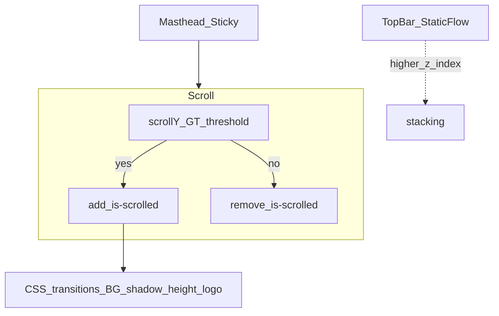

# How To: Top Bar + Sticky Header, Mobile Drawer, and Language Dropdown

A two-layer site chrome: a **top utility bar** in normal document flow (scrolls away) and a **sticky masthead** with primary navigation. Scroll position toggles a compact “solid bar” appearance. Below a breakpoint, navigation moves into a **full-screen overlay** behind a **hamburger** toggle. Language choice uses a **button + sibling list panel** pattern (desktop: drops below the button; mobile drawer: slides in from the side of the toggle).

---

## What It Looks Like

- **Top bar:** Narrow strip (contact links, secondary CTA). **Not sticky** — it moves up with the page as you scroll.
- **Masthead:** **Sticky** to the viewport top (`position: sticky`). Starts **transparent** (or styled per page template); after a small scroll threshold it gains **`is-scrolled`**: opaque background, subtle border/shadow, slightly shorter vertical padding, slightly smaller desktop logo.
- **Desktop (`> 768px`):** Horizontal **primary menu** + **language control** grouped on the right. No hamburger.
- **Mobile (`≤ 768px`):** **Hamburger** only; **`header-nav`** group hidden. Overlay menu lists the same **`wp_nav_menu`** output as desktop. **Logo variant** swaps to a compact logomark.
- **Language UI:** Toggle button reveals a short list of locale links (`href` to real URLs). One panel for desktop header, one duplicated inside the mobile drawer — same JS contract, slightly different CSS placement/animation.

---

## Dependencies

| Layer | Requirement |
|--------|--------------|
| **WordPress** | `wp_nav_menu()` (or block theme equivalent), `register_nav_menus()` |
| **Front-end JS** | Vanilla DOM (no jQuery required for this pattern) |
| **CSS** | Custom properties for layout tokens; **`body:has(#wpadminbar)`** (or `.admin-bar`) for logged-in offset |
| **Optional** | Design tokens: `--ease`, `--primary`, **`--header-height`** aligned with masthead inner height for overlay padding |

---

## Architecture (conceptual)



**Stacking:** Give the **top bar** a **higher `z-index`** than the masthead so any overlap resolves predictably during scroll transitions (example from reference implementation: top bar **201**, masthead **200**, mobile overlay **199**).

---

## HTML Structure (generic)

Order in the document matters: **top bar first**, then **`header`**, then **mobile overlay** (sibling after header is fine).

```html
<!-- 1. Top bar — scrolls away -->
<div class="site-top-bar">
  <div class="site-top-bar__inner">
    <div class="site-top-bar__contact"><!-- tel, email links --></div>
    <a href="/book/" class="site-top-bar__cta">Secondary CTA</a>
  </div>
</div>

<!-- 2. Sticky masthead -->
<header class="site-header" id="masthead">
  <div class="site-header__inner">
    <div class="site-branding">
      <a href="/" class="site-logo-link">
        
        
      </a>
    </div>

    <div class="header-nav-group">
      <nav class="main-navigation" id="site-navigation">
        <!-- wp_nav_menu output: ul#primary-menu -->
      </nav>

      <div class="lang-switcher">
        <button type="button" class="lang-switcher__toggle" aria-expanded="false" aria-haspopup="true">
          <span class="lang-switcher__current">EN</span>
          <svg class="lang-switcher__chevron"><!-- caret --></svg>
        </button>
        <ul class="lang-switcher__dropdown" role="menu">
          <li role="menuitem"><a href="…" class="lang-switcher__option is-active">EN</a></li>
          <li role="menuitem"><a href="…" class="lang-switcher__option">…</a></li>
        </ul>
      </div>
    </div>

    <button type="button" class="mobile-nav-toggle" aria-label="Open menu" aria-expanded="false" aria-controls="mobile-nav">
      <span class="mobile-nav-toggle__line"></span>
      <span class="mobile-nav-toggle__line"></span>
      <span class="mobile-nav-toggle__line"></span>
    </button>
  </div>
</header>

<!-- 3. Mobile overlay (outside header so fixed positioning is simple) -->
<div id="mobile-nav" class="mobile-nav-overlay" aria-hidden="true">
  <div class="mobile-nav__content">
    <nav class="mobile-nav__menu">
      <!-- Same theme_location / menu_class as desktop, e.g. ul.mobile-nav__links -->
    </nav>
    <div class="mobile-nav__lang">
      <button type="button" class="lang-switcher__toggle lang-switcher__toggle--mobile" aria-expanded="false" aria-haspopup="true">…</button>
      <ul class="lang-switcher__dropdown lang-switcher__dropdown--mobile" role="menu">…</ul>
    </div>
  </div>
</div>
```

**Notes**

- Duplicate **language markup** twice if you want identical behavior inside the drawer; both toggles participate in shared JS selectors.
- Tie hamburger **`aria-controls`** to overlay **`id`**.

---

## JavaScript behaviors

### 1. Masthead scroll class

Passive scroll listener avoids blocking the main thread. Toggle when past a tiny threshold (~**5px**) so tapping the scrollbar does not flap the state:

```pseudo
scrollThreshold = 5
header = querySelector(".site-header")
on scroll (passive: true):
  if window.scrollY > scrollThreshold
    header.classList.add("is-scrolled")
  else
    header.classList.remove("is-scrolled")

on DOMContentLoaded: run handler once for initial paint
```

### 2. Mobile overlay

```pseudo
toggle = ".mobile-nav-toggle"
overlay = "#mobile-nav"
debounceMs ≈ 280

openMobileNav():
  overlay.classList.add("is-open")
  overlay.setAttribute("aria-hidden", "false")
  toggle.classList.add("is-active")
  toggle.setAttribute("aria-expanded", "true")
  toggle.setAttribute("aria-label", "Close menu")  // localized string
  document.body.style.overflow = "hidden"

closeMobileNav(): inverse; restore aria-label Open; body overflow ""

toggle click:
  guard with isToggling flag → setTimeout clear after debounceMs
  if overlay has is-open → close else open

keydown Escape:
  if overlay is-open → closeMobileNav()

Optional: backdrop click closes (if overlay is not the same element as content, listen on overlay and ignore clicks on inner content only).
```

### 3. Language dropdown (desktop + mobile)

```pseudo
for each ".lang-switcher__toggle":
  dropdown = toggle.nextElementSibling  // must be the ul
  on toggle click:
    preventDefault + stopPropagation
    isOpen = dropdown has class "is-open"
    close ALL ".lang-switcher__dropdown" (remove is-open)
    set ALL toggles aria-expanded="false"
    if !isOpen:
      dropdown.classList.add("is-open")
      toggle.setAttribute("aria-expanded", "true")

on document click:
  close all dropdowns + reset aria-expanded

if mobile overlay exists:
  overlay click:
    if event.target.closest(".mobile-nav__lang"):
      stopPropagation()  // keeps document handler from fighting in-drawer opens
```

Navigation still uses **real `<a href>`** — the script only toggles visibility.

---

## CSS (behavioral reference)

### Top bar

- Dark or brand background; flex row; **max-width** aligned with header inner if desired.
- At **`max-width: 768px`**, hide low-priority items (e.g. email) and tighten padding/font size.

### Masthead: sticky + default + scrolled

```css
.site-header {
  position: sticky;
  top: 0;
  z-index: 200; /* below top bar if it ever overlaps */
  background: transparent;
  border-bottom: 0.5px solid transparent;
  transition: background 0.3s var(--ease), border-color 0.3s var(--ease), box-shadow 0.3s var(--ease);
}

.site-header.is-scrolled {
  background: rgba(255, 255, 255, 0.97);
  border-bottom-color: rgba(0, 0, 0, 0.09);
  box-shadow: 0 1px 4px rgba(0, 0, 0, 0.04);
}

/* Inner row height shrinks on scroll (desktop) */
.site-header__inner { height: 5rem; transition: height 150ms var(--ease); }
.site-header.is-scrolled .site-header__inner { height: 4rem; }
```

**Performance note:** Avoid **`backdrop-filter`** on the **sticky** masthead if scroll jank appears in Safari — a near-opaque rgba background often composites cheaper. A **fixed fullscreen** mobile overlay can still use blur because it is not recomposited on every scroll frame with the document.

### WordPress admin bar

When logged in, offset sticky **`top`** so the bar does not sit under the admin toolbar:

```css
body:has(#wpadminbar) .site-header,
.admin-bar .site-header {
  top: 32px;
}

@media (max-width: 782px) {
  body:has(#wpadminbar) .site-header,
  .admin-bar .site-header {
    top: 46px;
  }
}
```

### Logo swap + mobile height lock

```css
.site-logo--mobile { display: none; }

@media (max-width: 768px) {
  .site-logo--desktop { display: none; }
  .site-logo--mobile { display: block; }

  /* Same height before/after is-scrolled — avoids hero “jump” when class toggles */
  .site-header__inner,
  .site-header.is-scrolled .site-header__inner {
    height: 4rem;
  }
}
```

### Desktop nav group vs hamburger

```css
@media (max-width: 768px) {
  .header-nav-group { display: none; }
  .mobile-nav-toggle { display: flex; /* three lines */ }
}

@media (min-width: 769px) {
  .mobile-nav-toggle { display: none; }
  .mobile-nav-overlay { display: none; }
}
```

### Mobile overlay

```css
.mobile-nav-overlay {
  position: fixed;
  inset: 0;
  z-index: 199;
  padding: var(--header-height, 4rem) var(--space-lg) 2rem;
  opacity: 0;
  visibility: hidden;
  transition: opacity 0.3s var(--ease), visibility 0.3s var(--ease);
  /* optional: backdrop-filter on overlay only */
}

.mobile-nav-overlay.is-open {
  opacity: 1;
  visibility: visible;
}
```

Define **`--header-height`** in `:root` or a layout partial to match the masthead’s **fixed mobile inner height** (commonly **4rem**).

**Hamburger → X:** transform the three spans when **`.mobile-nav-toggle.is-active`** (translate + rotate middle line to hidden).

### Language dropdown

- **Desktop panel:** `position: absolute; top: calc(100% + 8px); right: 0;` Hidden via `opacity: 0; visibility: hidden; transform: translateY(-4px);` — **`.is-open`** restores visibility and neutral transform. Chevron rotates when **`[aria-expanded="true"]`**.
- **Mobile drawer panel:** second class (e.g. **`--mobile`**) uses horizontal offset: `left: calc(100% + gap); top: 0;` and **translateX** animation instead of **translateY**.

---

## Page templates: transparent header over a hero

For inner pages whose first section is a **full-bleed hero** under the masthead, use **body / template classes** so **before scroll** the header stays transparent and **nav + logo + hamburger** read as **light** on dark imagery:

```css
.page-template-your-hero-page .site-header:not(.is-scrolled) {
  background: transparent;
}

.page-template-your-hero-page .site-header:not(.is-scrolled) .site-logo {
  filter: brightness(0) invert(1); /* or swap to a light logo asset */
}

.page-template-your-hero-page .site-header:not(.is-scrolled) .main-navigation a,
.page-template-your-hero-page .site-header:not(.is-scrolled) .lang-switcher__toggle {
  color: #fff;
}

/* Mobile: hamburger light until open or scrolled */
@media (max-width: 768px) {
  .page-template-your-hero-page .site-header:not(.is-scrolled) .mobile-nav-toggle {
    color: #fff;
  }
  .page-template-your-hero-page .site-header:not(.is-scrolled) .mobile-nav-toggle.is-active {
    color: var(--text); /* contrast when icon morphs for close */
  }
}
```

Often the hero section uses **negative top margin** + compensating **padding-top** so content sits visually under the transparent bar — keep that spacing in sync with **combined top bar + masthead** height on each breakpoint.

---

## Multi-language menus (conceptual)

Before calling **`wp_nav_menu`**, pick **`theme_location`** from the current locale, e.g. fall back from **`primary-en`** to **`primary`** when a translation menu is missing:

```php
$preset = 'primary';
if ( $current_lang !== 'default' ) {
    $localized = 'primary-' . $current_lang;
    if ( has_nav_menu( $localized ) ) {
        $preset = $localized;
    }
}
wp_nav_menu( array(
    'theme_location' => $preset,
    'fallback_cb'    => false,
) );
```

Use the **same** `$preset` for both desktop and mobile menu calls so parity is guaranteed.

**URLs, path prefixes, string catalogs, rewrites, and **`lang_url()`** helpers** are covered in **[i18n-multi-language-urls.md](./i18n-multi-language-urls.md)**.

---

## Primary nav submenus (“dropdowns”) — extension

The reference stacks top-level links in a row only. **`sub-menu`** / **`.menu-item-has-children`** are **not** styled out of the box. To add dropdowns:

1. Output nested **`ul.sub-menu`** (WordPress default walker).
2. **`position: relative`** on **`li.menu-item-has-children`**.
3. **`position: absolute; top: 100%; left: 0;`** on **`ul.sub-menu`**, hide with `opacity`/`visibility` or `display`, **`z-index`** above siblings.
4. Show on **`li:hover`** and **`:focus-within`** for keyboard access.
5. Optional: mirror structure in mobile as **accordion** (separate JS) because hover does not apply.

---

## Quick reference checklist (porting)

- [ ] Top bar **above** masthead in DOM; optional **higher z-index** than sticky header  
- [ ] Masthead **`position: sticky`** + **`is-scrolled`** from JS after small **scrollY** threshold  
- [ ] Passive **`scroll`** listener; run once on load  
- [ ] **Admin-bar** **`top`** offset (32px / 46px)  
- [ ] **`max-width: 768px`**: hide inline nav group, show hamburger + overlay  
- [ ] Lock **mobile** inner height so **`is-scrolled`** does not reflow hero  
- [ ] Overlay: **`is-open`**, **`aria-*`**, **`body` overflow**, **Escape**  
- [ ] Language: toggle + next-sibling list, **`is-open`**, close on outside click, **`stopPropagation`** in mobile lang cluster  
- [ ] Optional: template-scoped **transparent / light** header rules + hero overlap spacing  
- [ ] Explicit plan if **`sub-menu`** is required (not covered by lang dropdown alone)  

---

This guide matches the style of sibling “How To” handoff documents: portable markup, pseudocode, and CSS patterns without binding readers to one theme’s filenames or PHP helper names.
