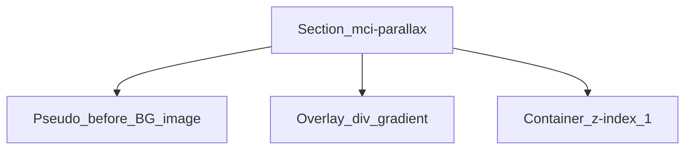

# How To: Bottom Homepage CTA — Parallax Photo, Gradient Overlay, Text + Contact Form

A full-width **call-to-action band** at the end of the homepage: **photographic background** with subtle **scroll parallax**, a **dark gradient overlay** for readability, and a **two-column** layout — **copy on the left**, **elevated form card** on the right. The same visual pattern appears on other inner pages as simpler “text + buttons” CTAs; this guide focuses on the **homepage form variant**.

---

## What It Looks Like

- **Background:** Large **cover** image on a dedicated pseudo-element layer (not on the section’s own `background`), so it can **translate on scroll** without repainting the whole section.
- **Overlay:** **Absolute** layer between the photo and the content: **vertical linear gradient** from semi-transparent dark at the top to **solid** brand dark at the bottom; **`pointer-events: none`** so clicks hit the form.
- **Foreground:** Constrained **container** with **`z-index`** above the overlay. **White headline and body copy** on the left; **white card** (rounded, shadow) containing the form on the right.
- **Motion:** Optional **fade-in** utilities with staggered delays on the two columns.
- **Form submit:** Progressive enhancement: traditional **POST** to the CMS; front-end **fetch** to an **AJAX endpoint** with button loading / success / error states.
- **Mobile:** **No parallax** — background is static `cover` (same variable, no transform). Grid becomes **one column**; form card gets tighter padding.

---

## Dependencies

| Piece | Role |
|--------|------|
| **`.mci-parallax` utility** | `::before` holds `background-image`; JS sets `--parallax-y` (name can match your design token prefix) |
| **Scroll script** | `requestAnimationFrame` batching; **disabled** when `prefers-reduced-motion: reduce` or viewport **≤768px** (align with your CSS breakpoint) |
| **Theme enqueue** | Localized **`ajax_url`**, **nonce**, and short user-facing strings for the submit button |
| **Server handler** | Verifies nonce, sanitizes fields, sends mail / stores lead; responds **JSON** for AJAX |

---

## Layer stack (conceptual)



1. **`section`** — `position: relative; overflow: hidden;` optional fallback **background-color** (e.g. dark) visible before the image decodes or if the image fails.
2. **`::before`** — `position: absolute; inset` slightly taller than the box (e.g. **`-15% 0`** top/bottom) so parallax translation does not show empty edges; `background-size: cover; background-position: center;` **`transform: translate3d(0, var(--parallax-y, 0), 0)`**; **`z-index: 0`**; **`pointer-events: none`**.
3. **Overlay `div`** — `position: absolute; inset: 0;` gradient; **`z-index`** between 0 and content (often implicit if content is `z-index: 1`; give overlay `z-index: 0` explicitly if needed).
4. **`.container`** — `position: relative; z-index: 1`.

**Inline image URL:** Set a custom property on the section, e.g. `style="--parallax-bg: url('…');"` and reference it in CSS as `background-image: var(--parallax-bg);` on **`::before`**.

---

## HTML structure (homepage form variant)

```html
<section
  class="consultation-cta mci-parallax"
  style="--mci-parallax-bg: url('/path/to/clinic-photo.jpg');"
>
  <div class="consultation-cta__overlay"></div>

  <div class="container">
    <div class="consultation-cta__grid">
      <div class="consultation-cta__info fade-in fade-in-delay-0">
        <h2>Ready to Transform Your Smile?</h2>
        <p>Supporting paragraph one.</p>
        <p>Supporting paragraph two.</p>
      </div>

      <div class="consultation-cta__form-wrap fade-in fade-in-delay-1">
        <h3>Send Message</h3>
        <form action="/wp-admin/admin-post.php" method="post">
          <input type="hidden" name="action" value="your_contact_form_action">
          <!-- wp_nonce_field / honeypot / locale hidden field as needed -->

          <div class="form-group">
            <label for="cta-name">Full Name</label>
            <input type="text" id="cta-name" name="contact_name" required>
          </div>
          <!-- phone, email, textarea -->

          <button type="submit" class="btn btn-primary">Send Message</button>
        </form>
      </div>
    </div>
  </div>
</section>

<!-- Class name note: rename consultation-cta / home-v2-consultation to your BEM prefix. -->
```

---

## CSS (reference)

### Parallax utility (shared)

Reuse the same rules anywhere you need a tinted photo hero or CTA:

```css
.mci-parallax {
  position: relative;
  overflow: hidden;
}

.mci-parallax::before {
  content: '';
  position: absolute;
  inset: -15% 0;
  background-image: var(--mci-parallax-bg);
  background-size: cover;
  background-position: center;
  transform: translate3d(0, var(--mci-parallax-y, 0px), 0);
  will-change: transform;
  z-index: 0;
  pointer-events: none;
}

.mci-parallax > * {
  position: relative;
  z-index: 1;
}

@media (max-width: 768px) {
  .mci-parallax::before {
    inset: 0;
    transform: none;
    will-change: auto;
  }
}
```

### Section + overlay + grid

```css
.consultation-cta {
  position: relative;
  padding: var(--space-3xl) 0;
  background-color: var(--color-secondary-dark); /* fallback */
}

.consultation-cta__overlay {
  position: absolute;
  inset: 0;
  background: linear-gradient(to bottom, rgba(29, 29, 31, 0.35), #1d1d1f);
  pointer-events: none;
  z-index: 0;
}

.consultation-cta .container {
  position: relative;
  z-index: 1;
}

.consultation-cta__grid {
  display: grid;
  grid-template-columns: 1fr 1fr;
  gap: var(--space-2xl);
  align-items: center;
}

.consultation-cta__info h2 {
  font-size: 2rem;
  margin-bottom: var(--space-lg);
  color: var(--color-white);
}

.consultation-cta__info p {
  font-size: 1.05rem;
  color: rgba(255, 255, 255, 0.8);
  line-height: 1.65;
  margin-bottom: var(--space-lg);
}

.consultation-cta__form-wrap {
  background-color: var(--color-surface);
  border-radius: var(--radius-lg);
  padding: var(--space-xl);
  box-shadow: var(--shadow-md);
}

.consultation-cta__form-wrap h3 {
  font-size: 1.4rem;
  margin-bottom: var(--space-lg);
}

.consultation-cta__form-wrap .btn {
  width: 100%;
}

@media (max-width: 768px) {
  .consultation-cta__grid {
    grid-template-columns: 1fr;
  }
  .consultation-cta__form-wrap {
    padding: var(--space-md);
  }
}
```

**Z-index nuance:** If every direct child gets **`z-index: 1`** from a shared **`.parallax-root > *`** rule (as in many implementations), rely on **DOM order**: **`::before`** at **`z-index: 0`** (photo), then **overlay**, then **container** so the container paints above the tint. Alternatively, set **`overlay` to `z-index: 0`** and **`container` to `z-index: 1`** explicitly to avoid ambiguity.

---

## Parallax JavaScript (behavior)

Pattern: for each `.mci-parallax` element in view, compute a **slow vertical drift** based on **`getBoundingClientRect().top`** and write a CSS variable.

```pseudo
FACTOR = 0.25  // tune: lower = subtler
MOBILE_MAX = 768

if prefers-reduced-motion: return

sectionEls = querySelectorAll(".mci-parallax")
if empty: return

on scroll (passive):
  schedule rAF

on frame:
  if viewportWidth <= MOBILE_MAX: return  // CSS already disables transform
  for each sectionEls:
    rect = el.getBoundingClientRect()
    if rect is outside viewport vertically: optionally skip or still update
    offset = -(rect.top * FACTOR)
    el.style.setProperty("--mci-parallax-y", offset + "px")

on resize: refresh viewport flags; clear vars when crossing mobile breakpoint
```

**Why `translate3d` on `::before`:** Promotes a **GPU layer** so scrolling composites the background without repainting foreground text and form controls.

---

## Contact form — server + AJAX (conceptual)

1. **Markup:** Form **`action`** points at **`admin-post.php`** with **`method="post"`** so submissions work **without JavaScript**.
2. **Hidden fields:** **`action`** name your handler expects, **`nonce`**, optional **`language`** for routing email templates.
3. **Registered hooks:** **`admin_post_{$action}`** and **`admin_post_nopriv_{$action}`** for redirects; **`wp_ajax_{$action}`** and **`wp_ajax_nopriv_{$action}`** for JSON responses.
4. **Front-end:** **`querySelectorAll('form[action*="admin-post.php"]')`**, verify inner **`input[name="action"]`**, **`submit` → preventDefault()`, **`FormData`**, **`fetch`** to **`ajax_url`**, **`Content-Type`** not needed for `FormData`. Refresh **nonce** from localized script object if AJAX uses a dedicated REST/AJAX nonce.
5. **UX:** Disable button, show spinner (e.g. replace label with **`span.btn-spinner`**), on success swap text to “Sent!”, **`reset()`** form; reset button after timeout; error state similarly.

Handlers should **`sanitize_*`**, validate email, **`wp_mail`** or CRM API, **`wp_send_json_success` / `_error`** when `DOING_AJAX`.

---

## Fade-ins

Reuse your site-wide **`IntersectionObserver`** pattern: **`fade-in`** + **`fade-in-delay-n`** classes; thresholds and stagger match other homepage sections — see sibling handoff docs for hero and contact grid if needed.

---

## Variants on inner pages

The same **`mci-parallax` + overlay** stack often powers **full-bleed CTAs** with **centered copy and button row** instead of a form — same overlay token, thinner section padding, **`text-align: center`**. Swap inner markup only; keep the parallax and gradient recipe.

---

## Checklist (porting)

- [ ] Section + **`::before`** + **`--parallax-bg`** + mobile static fallback  
- [ ] Gradient overlay, **`pointer-events: none`**  
- [ ] Content **`z-index`** above backdrop  
- [ ] Two-column grid; single column **`≤768px`**  
- [ ] Form nonce + AJAX + non-JS **`admin-post`** fallback  
- [ ] Reduced motion + mobile off for parallax JS  
- [ ] Spinner / success strings localized  

---

This document describes layout, motion, and form wiring in a portable way. Wire **email recipients**, **spam protection**, and **privacy copy** per your deployment.
