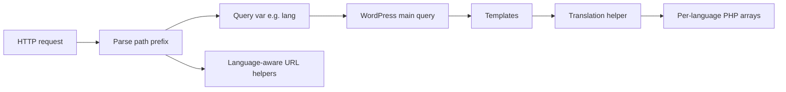

# General guide: path-prefix multilingual sites (WordPress-style)

This pattern implements **multilingual behavior in the theme** (or a small companion plugin), instead of relying on WPML or Polylang. The idea is: **one WordPress install**, **one set of pages**, **language encoded in the URL path**. Below is the architecture in abstract terms.

---

## 1. Architecture at a glance

- **Default language**: no prefix (e.g. `/about/`).
- **Other languages**: first segment is a code (e.g. `/ru/about/`, `/el/about/`).
- **Content source**: still normal WordPress pages; language typically changes **strings** (and optionally **menus**), not separate posts per language unless you extend the system.

---

## 2. Declare supported languages

- Define a list of locale codes (e.g. `en`, `ru`, `el`) and which one is **default**.
- Every later step (rewrites, hreflang, switcher) should read from this single source of truth.

---

## 3. Detect current language

Typical order:

1. **Custom query variable** set by rewrite rules (most reliable once routing works).
2. **Fallback**: parse `REQUEST_URI`—if the first path segment is a known non-default code, that is the language; otherwise default.

Use **static caching** inside the getter so you do not re-parse on every call in one request.

---

## 4. URL routing (rewrites + query)

- Register a **query var** (e.g. `lang`) via the `query_vars` filter.
- On `init`, add **rewrite rules**:
  - Front page in a non-default language: `/{lang}/` → `index.php?lang={code}`.
  - Inner pages: `/{lang}/{pagename}/` → `index.php?lang={code}&pagename=...`.
- **Front page edge case**: when `lang` is set but WordPress would not resolve a page, hook **`pre_get_posts`** on the main query to force the static front page (`page_id` = “page on front”) so `/ru/` shows the home template, not an empty query.
- **Flush rules** after theme activation and optionally when your i18n “version” changes so updates are not silently ignored.
- **Canonical redirects**: WordPress may try to “fix” prefixed URLs. Use the **`redirect_canonical`** filter to **disable redirect** when the path starts with a valid language prefix, so `/ru/services/` is not stripped to `/services/`.

---

## 5. Translation storage (dictionary pattern)

- **Default language**: templates use **human-readable English strings as keys** (or stable keys like `seo_title_home` for long SEO text).
- **Other languages**: one PHP file per locale that **returns an associative array**: English key → translated string.
- **Load lazily**: include the file only for the active language; **cache in a static variable** per request.
- **Helpers**:
  - `t( $key )` — return translation or key if missing/default language.
  - `te( $key )` — echo escaped HTML text.
  - Optional: a variant that post-processes markers (for example `{accent}...{/accent}` for styled spans)—keep markup out of the dictionary if you prefer, or use a small, documented convention.

This is **not** GNU gettext (`.po`/`.mo`); it is **theme-owned dictionaries**. You can still use WordPress `__()` / `esc_html_e()` with a text domain for **generic theme strings** (menus, search, comments) where standard translation packs make sense.

---

## 6. Language-aware URLs in templates

- **`url( $path )`**: prepend `/{lang}` for non-default languages when building internal links; default language uses the plain path.
- **`lang_url( $target_lang )`**: same logical path as the current request but with another language prefix (for a **language switcher**). Implementation: strip an existing language prefix from the current path, then rebuild with the target prefix (default: no prefix).

Always use these helpers for **internal navigation** so links stay inside the active locale.

---

## 7. Navigation menus

Two complementary tactics:

1. **Filter menu objects** (`wp_nav_menu_objects`): for each item whose URL is internal, rewrite the URL to include the current language prefix (avoid double-prefixing).
2. **Optional separate menu locations** per language (e.g. `primary`, `primary-ru`, `primary-el`): in the header/footer, if a location is registered and assigned for the current language, use it; otherwise fall back to the default location. This lets editors use different labels/order per language without code changes.

---

## 8. Language switcher (UI)

- Links are plain anchors to `lang_url( 'en' )`, `lang_url( 'ru' )`, and so on—**full page load**, no SPA state. Reliable and crawlable.
- Mark the active option for styling and accessibility.

---

## 9. Browser language suggestion (optional)

- On **first visit to the site root** only (empty path): if no **preference cookie** exists, parse **`Accept-Language`**, pick the best-supported non-default language, **set a long-lived cookie**, and **redirect once**.
- Skip for **crawlers** (user-agent heuristics) to avoid SEO noise.
- On every request (or after language is known), **sync the cookie** to the current URL language so manual switches stay aligned with the URL.

---

## 10. HTML and HTTP semantics

- Filter **`language_attributes`** so `<html lang="...">` matches the active locale (map short codes to BCP 47 if needed, e.g. `en` → `en-US`).
- If you output **`Content-Language`** or similar meta, align it with the same map.

---

## 11. SEO: hreflang, titles, descriptions, social

- **Hreflang**: for each supported language, output `<link rel="alternate" hreflang="..." href="...">` for the **same logical path** with the correct prefix; add **`x-default`** (usually the default language URL).
- **Title and meta description**: drive from the same dictionary keys as body copy so SERPs match the visible language.
- **Canonical URL**: build from the **current** full URL (including language prefix) so each locale is self-canonical.
- **Open Graph / Twitter / JSON-LD**: reuse translated strings and language-aware URLs where text is exposed to crawlers or shares.

---

## 12. JavaScript and forms

- Pass **current language** and **short UI strings** into the front-end script via **`wp_localize_script`** (or a small inline JSON), using the same `t()` helper so toasts, buttons, and dynamic messages match PHP.
- For server handlers (contact forms, AJAX), include a **hidden field** with the form’s language if emails or logging should record locale.

---

## 13. Operational checklist

| Area | Action |
|------|--------|
| New copy in templates | Add default-language string in template; add keys to every non-default language file |
| New page slug | Same slug for all languages; only the prefix changes |
| After changing rewrite rules | Flush rewrite rules |
| Menus | Assign language-specific menus to dedicated locations if needed |
| SEO | Keep hreflang and canonical in sync with supported languages |

---

## 14. Tradeoffs (when to use this vs plugins)

**This pattern fits** when you want **full control**, **no plugin lock-in**, **predictable URLs**, and mostly **static or marketing** copy with a **fixed set of languages**.

**Consider WPML/Polylang** when you need **per-language posts**, **editor-managed translations**, **WooCommerce**, or **large editorial workflows** without touching PHP arrays.

---

## Reference in this repository

The Maria Charalambous-Ivanova theme applies this approach in:

- [`inc/i18n.php`](../inc/i18n.php) — language detection, rewrites, translation helpers, URL helpers, browser redirect, cookie, menu URL filter
- [`inc/translations/`](../inc/translations/) — per-locale PHP arrays
- [`inc/seo.php`](../inc/seo.php) — hreflang, localized titles/descriptions, canonical, structured data
- [`functions.php`](../functions.php) — loads i18n, passes language and strings to scripts

The sections above describe the **method**; names and file layout can differ in another project.
